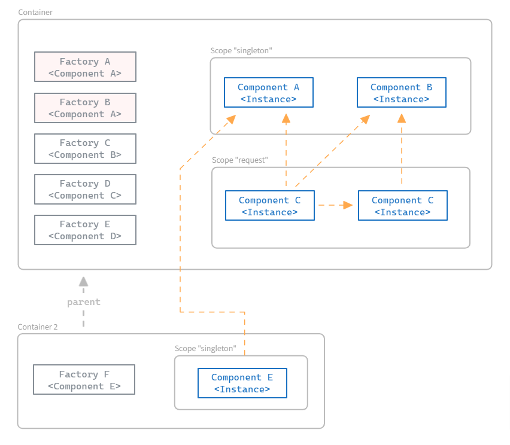

# di [WIP]

This is The Way to do Dependency injection in Go.


```go

import "github.com/nidorx/di"

type JediService interface {
    FeelTheForce()
}

type PadawanController struct {
    s JediService
}

func (p * PadawanController) Initialize() {
    p.s.FeelTheForce()
}

// register as startup component, injecting dependencies
di.Register(func(s JediService) *PadawanController {
	return &PadawanController{s:s}
}, di.Startup(100))


// (...) in a package far, far away ...

type yodaServiceImp struct {}

func (s * yodaServiceImp) FeelTheForce() {
    print("Patience you must have my young Padawan")
}

di.Register(&yodaServiceImp{})

// ... and
di.Initialize() 
```


Essa implementação tem como objetivos principais ser:

- de fácil entendimento
- Type safe, fazendo uso ge generics
- extensível e configurável
- base para o desenvolvimento de frameworks e estruturas arquiteturais mais complexas.

---
---
> VOCÊ É ALÉRGICO? ATENÇÃO!
> 
> Alguns conceitos aplicados nessa biblioteca podem conter Glúten e/ou inspirações nas implementações do [CDI Java](https://www.cdi-spec.org/) e [Spring IoC](https://docs.spring.io/spring-framework/reference/core/beans.html). 
> 
> E obviametne que também usamos [reflection](https://pkg.go.dev/reflect), o que para alguns desinformados pode ser fatal. Importante mencionar que sanitizamos bem as mãos antes de manusear qualquer `Type` ou `Value`.
>
> Não nos responsabilizaremos se você se tornar um desenvolvedor produtivo após entrar em contato com algum pedaço do di
---
---

O diagrama abaixo apresenta de forma resumida o funcionamento desse container de DI.

* **Container**: A implementação atual que permite ao desenvolvedor registrar e obter seus componentes.
* **Component**: Qualquer objeto (simples ou complexo) que o desenvolvedor deseja registrar no container para que possa ser utilizado por outros componentes (injetado). Durante a injeção da dependencia o construtor injetado não sabe como o componente requisitado será criado. o Container resolve a dependencia simplificando o desenvolvimento de sistemas complexos.
* **Factory**: Informa como uma instancia de um componente pode ser criado. O desenvolvedor registra no container um construtor de componente ou mesmo uma instancia e o Container faz o processamento necessário para gerar a Fábrica desse componente e resolver suas dependencias quando o construtor for invocado. É possível ter mais de um Factory para o mesmo tipo de componente. O Container certifica de obter a instancia correta conforme as regras descritas mais abaixo no corpo desse documento.
* **Scope**: Gerencia o ciclo de vida de uma instancia. O desenvolvedor especifica o escopo do componente durante o registro. Quando o componente é requerido, o Container solicita a instancia ao Scope definido. O Scope pode retornar uma instancia existente ou criar uma nova. Isso permite a instanciação de componentes com ciclo de vida diversos, por exemplo, instancias que serão descartadas ao final de um requisição web e outras instancias Singleton que ficaram vivas até que toda a aplicação seja finalizada.




Getting started

`go get ` 
