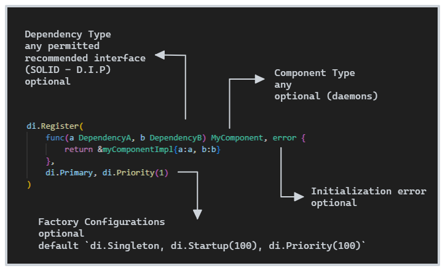

# di [WIP]

This is The Way to do Dependency injection in Go.


```go

import "github.com/go-path/di"

type JediService interface {
    FeelTheForce()
}

type PadawanController struct {
    s JediService
}

func (p * PadawanController) Initialize() {
    p.s.FeelTheForce()
}

// register as startup component, injecting dependencies
di.Register(func(s JediService) *PadawanController {
	return &PadawanController{s:s}
}, di.Startup(100))


// (...) in a package far, far away ...

type yodaServiceImp struct {}

func (s * yodaServiceImp) FeelTheForce() {
    print("Patience you must have my young Padawan")
}

di.Register(&yodaServiceImp{})

// ... and
di.Initialize() 
```

Essa implementação tem como objetivos principais ser:

- de fácil entendimento
- Typesafe, fazendo uso ge generics
- extensível e configurável
- base para o desenvolvimento de frameworks e estruturas arquiteturais mais complexas.

---
> VOCÊ É ALÉRGICO? ATENÇÃO!
> 
> Alguns conceitos aplicados nessa biblioteca podem conter Glúten e/ou inspirações nas implementações do [CDI Java](https://www.cdi-spec.org/) e [Spring IoC](https://docs.spring.io/spring-framework/reference/core/beans.html). 
> 
> E obviametne que essa implementação usa [reflect](https://pkg.go.dev/reflect), o que para alguns desinformados pode ser fatal. Importante mencionar que sanitizamos bem as mãos antes de manusear qualquer `Type` ou `Value`.
>
> Não nos responsabilizamos se você se tornar um desenvolvedor produtivo após entrar em contato com algum pedaço dessa lib
>
> "Your path you must decide.” — Yoda
---


**Não sabe o que é DI?** [Wikipedia](https://en.wikipedia.org/wiki/Dependency_injection)


O diagrama abaixo apresenta de forma resumida o funcionamento desse container de DI.

* **Container**: A implementação atual que permite ao desenvolvedor registrar e obter seus componentes.
* **Component**: Qualquer objeto (simples ou complexo) que o desenvolvedor deseja registrar no container para que possa ser utilizado por outros componentes (injetado). Durante a injeção da dependencia o construtor injetado não sabe como o componente requisitado será criado. o Container resolve a dependencia simplificando o desenvolvimento de sistemas complexos.
* **Factory**: Informa como uma instancia de um componente pode ser criado. O desenvolvedor registra no container um construtor de componente ou mesmo uma instancia e o Container faz o processamento necessário para gerar a Fábrica desse componente e resolver suas dependencias quando o construtor for invocado. É possível ter mais de um Factory para o mesmo tipo de componente. O Container certifica de obter a instancia correta conforme as regras descritas mais abaixo no corpo desse documento.
* **Scope**: Gerencia o ciclo de vida de uma instancia. O desenvolvedor especifica o escopo do componente durante o registro. Quando o componente é requerido, o Container solicita a instancia ao Scope definido. O Scope pode retornar uma instancia existente ou criar uma nova. Isso permite a instanciação de componentes com ciclo de vida diversos, por exemplo, instancias que serão descartadas ao final de um requisição web e outras instancias Singleton que ficaram vivas até que toda a aplicação seja finalizada.


## Docs

### Installation

`go get github.com/go-path/di` 

### Container

[`di.Container`](https://github.com/go-path/di/blob/main/container.go#L17) is owr IoC Container.

Se necessário você pode instanciar novos containers com o método `New(parent Container) Container`. Nós já registramos um container [global](https://github.com/go-path/di/blob/main/global.go) e expomos todos os métodos para simplificar o uso da biblioteca.

Geralmente você só precisa interarir com o método `di.Register(ctor any, opts ...FactoryConfig)` para registro de componentes e finalmente o método  `di.Initialize(contexts ...context.Context) error` para que o container possa incializar os componentes configurados com `Startup`.

Quando estiver fazendo testes unitários no seu projeto, dê uma olhada no método `Mock(mock any) (cleanup func())`.

Se você está construindo uma arquitetura mais complexa na sua organização ou alguma biblioteca com suporte a di, você provavelmente vai utilizar os métodos abaixo e outros que estão documentados na api para ter total controle sobre os Componentes.

```
RegisterScope(name string, scope ScopeI) error

Get(key reflect.Type, contexts ...context.Context) (any, error)
Filter(options ...FactoryConfig) *FilteredFactories

Contains(key reflect.Type) bool

GetObjectFactory(factory *Factory, managed bool, contexts ...context.Context) ObjectFactory
GetObjectFactoryFor(key reflect.Type, managed bool, contexts ...context.Context) ObjectFactory
ResolveArgs(factory *Factory, contexts ...context.Context) ([]reflect.Value, error)
Destroy() error

DestroyObject(key reflect.Type, object any) error
DestroySingletons() error
```

## Registrar Componentes e Serviços/Daemons

Nós registramos serviços usando o método `di.Register(ctor any, opts ...FactoryConfig)`. NÃO ENTRE EM PÂNICO, mas esse método causa `panic` se houver algum erro no registro do componente. Isso acontece pois o esperado é que o registro de um componente não falhe. Se você precisar gerenciar o registro de um componente, utilize o método alternativo `ShouldRegister(ctor any, opts ...FactoryConfig) error` que retorna um erro.

O formato geral de registro de um componente é:



```go
di.Register(
    func(a DependencyA, b DependencyB) MyComponent, error {
        return &myComponentImpl{a:a, b:b}
    }, 
    di.Primary, di.Priority(1)
)
```

Caso o componente não precise de um construtor (true Singleton), utilize o padrão abaixo, retornando a instancia que será usada em todo o container.

```go
di.Register(&myComponentImpl{}, di.Primary, di.Priority(2))
```

Se você deseja registrar um serviço/daemon, utilize o padrão abaixo. Esse formato só é útil para serviços que vão ser inicializado junto com o container (configuração `di.Startup(priority)`)

```go
di.Register(
    func(a DependencyA, b DependencyB) error {
        print("initialized")
    }, 
    di.Startup(100)
)
```

### Component Type = KEY & Factory Configurations

O tipo do retorno da função construtora determina o tipo do seu componente. Essa é a chave usada internamente pelo container para identificar os objetos. Você pode registrar quantos candidatos desejar para o mesmo tipo de retorno, e usar as configurações da fábrica para ajustar a prioridade, o escopo ou até mesmo qualificar algum componente, permitindo que o container possa identificar o construtor mais adequado durante o processo de injeção.

Existe um capitulo mais abaixo descrevendo as Factory Configurations existentes o como elas podem ser usadas para permitir um desenvolvimento modular da sua aplicação.

### Dependencias

Você pode usar qualquer tipo de objeto para identificar suas dependencias, porém o mais recomendado é seguir o [Princípio da Inversão de Dependencia](https://en.wikipedia.org/wiki/Dependency_inversion_principle), utilizando as `interface` e permitindo que o container possa obter a instancia compatível. Isso reduz o acoplamento entre os modulos da sua aplicação, simplificando a manutenção e testes unitários.

O container aplica a seguintes regras de priorização para determinar as fábricas candidatas para criação da dependencia.

1. Os componentes registrados com o mesmo tipo da dependencia (exact match)
2. Os componentes registrados em que a dependecia solicitada é assignable com tipo do componente registrado (see [Type.AssignableTo](https://pkg.go.dev/reflect#Type.AssignableTo), [Go Assignability](https://go.dev/ref/spec#Assignability))


Exemplo
```go
type DependencyA interface { DoIt() }
type DependencyB interface { DoItBetter() }

type dependencyAImpl struct { /*...implements_A_DoIt()...*/ }
type dependencyBImpl struct { /*...implements_B_DoItBetter()...*/ }

// Component Type = Key = typeof DependencyA
di.Register(func() DependencyA { return &dependencyAImpl{} })

// Component Type = Key = typeof *dependencyBImpl
di.Register(func() dependencyBImpl { return &dependencyBImpl{} })

// a Key = typeof DependencyA, exact match (registered before)
// b Key = typeof DependencyB, assignable match (typeof *dependencyBImpl)
// c Key = typeof *dependencyAImpl, assignable match (typeof DependencyA)
// d Key = typeof *dependencyBImpl, exact match (registered before)
di.Register(func(a DependencyA, b DependencyB, c *dependencyAImpl, d *dependencyBImpl) {
    // a == c
    // b == d
})
```

## Factory Configurations

O di disponibiliza algumas configurações sobre as fábricas de componentes, permitindo que o desenvolvedor possa configurar o ciclo de vida dos componentes ou mesmo gerar identificadores para permitir a obtenção de componentes que possuam algum marcador específico.

### Initializer
Initializer register a initializer function to the component. A factory component may declare multiple initializers methods. If the factory returns nil, the initializer will be ignored


### Disposer
Disposer register a disposal function to the component. A factory component may declare multiple disposer methods. If the factory returns nil, the disposer will be ignored


### Startup
Startup indicates that this component must be initialized during container initialization (Container.Initialize method)

```go
di.Register(func()  {
	print("Second")
}, Startup(200))

di.Register(func()  {
	print("First")
}, Startup(100)) 
```

### Priority
Priority can be applied to any component to indicate in what order they should be used.

If the component is marked as Startup, the priority determines its execution order.

Priority is also used during dependency injection. The candidate with the highest priority will be injected.

A framework can implement filters and use priority to define the order of execution

### Qualify
Qualify register a qualifier for the component. Anyone can define a new qualifier.

```go
type MyQualifier string

di.Register(func() *MyService {
	return &MyService{}
}, di.Qualify[testQualifier]())
```

### Primary
Primary indicates that a component should be given preference when multiple candidates are qualified to inject a single-valued dependency. 
If exactly one 'primary' component exists among the candidates, it will be the injected value.

```go
di.Register(func(repository FooRepository) FooService {
	return &FooServiceImpl{ repository: repository }
})

di.Register(func() FooRepository {
	return &MemoryRepositoryImpl{}
})

di.Register(func() FooRepository {
	return &DatabaseRepositoryImpl{}
}, di.Primary)
```
Because DatabaseRepositoryImpl is marked with Primary, it will be injected preferentially over the MemoryRepositoryImpl variant assuming both are present as component within the same di container.

### Alternative
Alternative indicates that a component should NOT be given preference when multiple candidates are qualified to inject a single-valued dependency.

If exactly one NON-ALTERNATIVE component exists among the candidates, it will be the injected value.

```go
di.Register(func(repository FooRepository) FooService {
	return &FooServiceImpl{ repository: repository }
})

di.Register(func() FooRepository {
	return &MemoryRepositoryImpl{}
})

di.Register(func() FooRepository {
	return &DatabaseRepositoryImpl{}
}, di.Alternative)
```
Because DatabaseRepositoryImpl is marked with Alternative, it will NOT be injected over the MemoryRepositoryImpl variant assuming both are present as component within the same di container.

### Scoped
Scoped identifies the lifecycle of an instance, such as singleton, prototype, and so forth.. A scope governs how the container reuses instances of the type.

To register additional custom scopes, see Container.RegisterScope. Defaults to an empty string ("") which implies SCOPE_SINGLETON.

### Singleton (aka Scoped("singleton"))

Singleton identifies a component that only instantiates once.

```go
di.Register(func() MyService {
	return &MyServiceImpl{ Id: uuid.New() }
}, di.Singleton)

di.Register(func(s MyService) MyControllerA {
	print(s.Id) // uuid value
})

di.Register(func(s MyService) MyControllerB {
	print(s.Id) // same uuid value
})
```

### Singleton (aka Scoped("prototype"))
Prototype identifies a component that a new instance is created every time the component factory is invoked.

```go
di.Register(func() MyService {
	return &MyServiceImpl{ Id: uuid.New() }
}, di.Prototype)

di.Register(func(s MyService) MyControllerA {
	print(s.Id) // first uuid
})

di.Register(func(s MyService, ctn di.Container, ctx context.Context) MyControllerB {
	print(s.Id) // second uuid
	s2, _ := di.Get[testService](ctn, ctx)
	print(s2.Id) // third uuid
})
```

### Condition
Condition a single condition that must be matched in order for a component to be registered.

Conditions are checked immediately before the component factory is due to be registered and are free to veto registration based on any criteria that can be determined at that point.

### Stereotype
Stereotype a stereotype encapsulates any combination of ComponentOption

```go
var Controller = di.Stereotype(di.Singleton, di.Qualify[testQualifier](), di.Startup(500))

di.Register(func() MyController {
    return &MyController{}
}, Controller)
```

Example: Filter using Stereotype

```go
di.Filter(Controller).Foreach(func(f *Factory) (bool, error) { ... })
```


## Qualify

## Provider

## Unmanaged

## Scope

## Utils

## Instanciar um Componente ou Serviço na Inicializaçao

Componentes ou serviços podem ser inicialziados junto com o Container (`di.Initialize(ctx)`) por meio da configuração `di.Startup(priority)`. Isso é útil para que você possa inicializar os serviços essenciais da sua aplicação de forma sincronizada, como por exemplo:

- Executar scripts de migração de banco de dados
- Fazer o carregamento das configurações do sistema
- Registrar as suas controladores Rest ou seus endpoints
- Executar validações do ambiente

Com o uso do di é possível implementar separadamente cada um desses serviços e especificar sua ordem de execução, conforme o exemplo abaixo.


```go

// package config

di.Register(func() error {
	// we dont need to return a Component
    return doSomeEnvValidation()
}, di.Startup(0))

type JediService interface {
    FeelTheForce()
}

type PadawanController struct {
    s JediService
}

func (p * PadawanController) Initialize() {
    p.s.FeelTheForce()
}

// register as startup component, injecting dependencies
di.Register(func(s JediService) *PadawanController {
	return &PadawanController{s:s}
}, di.Startup(100))


// (...) in a package far, far away ...

type yodaServiceImp struct {}

func (s * yodaServiceImp) FeelTheForce() {
    print("Patience you must have my young Padawan")
}

di.Register(&yodaServiceImp{})

// package main

func main() {
    di.Initialize() 
}

```

