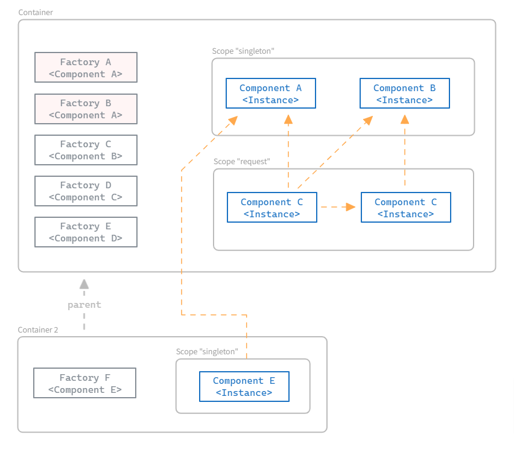

## Docs

### Installation

`go get github.com/go-path/di` 

# How does it work?

The diagram below provides a summarized overview of how this DI container functions.

* **Container**: The current implementation allows the developer to register and obtain their components.
* **Component**: Any object (simple or complex) that the developer wishes to register in the container to be used by other (injected) components. During dependency injection, the injected constructor does not know how the requested component will be created. The container resolves the dependency, simplifying the development of complex systems.
* **Factory**: It informs how an instance of a component can be created. The developer registers a component constructor or even an instance in the container, and the container performs the necessary processing to generate the factory for that component and resolve its dependencies when the constructor is invoked. It is possible to have more than one factory for the same type of component. The container ensures that the correct instance is obtained according to the rules described later in this document.
* **Scope**: It manages the lifecycle of an instance. The developer specifies the scope of the component during registration. When the component is requested, the container asks the defined scope for the instance. The scope can return an existing instance or create a new one. This allows for the instantiation of components with various lifecycles; for example, instances that will be discarded at the end of a web request and other singleton instances that will remain alive until the entire application is terminated.