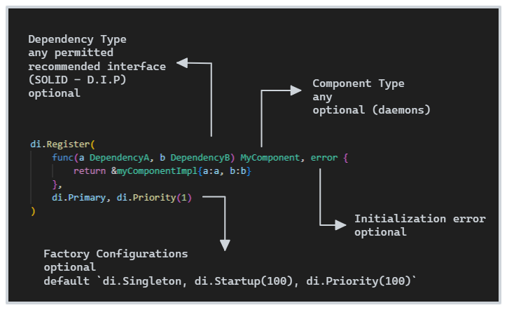

# Component

We register components using the `di.Register(ctor any, opts ...FactoryConfig)` method. **DO NOT PANIC**, but this method causes `panic` if there is an error in the component registration. This happens because the expectation is that the registration of a component does not fail. If you need to manage the registration of a component, use the alternative method `ShouldRegister(ctor any, opts ...FactoryConfig) error` which returns an error.

The general format for a component constructor is:



```go
di.Register(func(a DependencyA, b DependencyB) MyComponent, error {
    return &myComponentImpl{a:a, b:b}
})
```

If the component does not need a constructor (true Singleton), use the pattern below, returning the instance that will be used throughout the container.

```go
di.Register(&myComponentImpl{})
```

## Daemon

Components can be started together with the Container (`di.Initialize(ctx)`) through the `di.Startup(order)` configuration. This is useful so that you can initialize your application's essential services synchronously, such as:

- Run database migration scripts
- Upload system settings
- Register your Rest controllers or your endpoints
- Perform environment validations

Using di it is possible to implement each of these services separately and specify their order of execution, as shown in the example below.

```go
func init() {

    di.Register(func() {
        print("first")
    }, di.Startup(100))

    di.Register(func() {
        print("second")
    }, di.Startup(200))

    di.Initialize()
}
```

## Structs

You can use the `de.Injected[T]()` method to generate your component's constructor using the `inject` struct tag.

```go
type MyService struct {
    Dependency MyDependency `inject:""`
}

func (s* MyService) Intitialize(){
    print("initialized")
}

func init(){
    di.Register(di.Injected[*MyService]())
}
```

## Dependencies

You can use any type of object to identify your dependencies, but the most recommended is to follow the [Dependency Inversion Principle](https://en.wikipedia.org/wiki/Dependency_inversion_principle), using `interface`, leaving it to the container the responsibility of obtaining the compatible instance. This reduces coupling between your application modules, simplifying maintenance and unit testing.

The container applies the following prioritization rules to determine candidate factories for creating the dependency.

1. Components registered with the same dependency type (exact match)
2. Registered components in which the requested dependency is assignable with the type of the registered component (see [Type.AssignableTo](https://pkg.go.dev/reflect#Type.AssignableTo), [Go Assignability](https://go.dev/ref/spec#Assignability))


Example of declaring and using a valid dependency. Note that we registered the component of type `typeof *dependencyBImpl`. This component is assignable with `b DependencyB` and `c *dependencyBImpl`.
```go
type DependencyA interface { DoIt() }
type DependencyB interface { DoItBetter() }

type dependencyAImpl struct { /*...implements_A_DoIt()...*/ }
type dependencyBImpl struct { /*...implements_B_DoItBetter()...*/ }

// Component Type = Key = typeof DependencyA
di.Register(func() DependencyA { return &dependencyAImpl{} })

// Component Type = Key = typeof *dependencyBImpl
di.Register(func() dependencyBImpl { return &dependencyBImpl{} })

// a Key = typeof DependencyA, exact match (di.Register)
// b Key = typeof DependencyB, assignable match ('*testServiceBImpl' is a candidate for 'testServiceB')
// c Key = typeof *dependencyBImpl, exact match (di.Register)
di.Register(func(a DependencyA, b DependencyB, c *dependencyBImpl) {    
    // b == c
})
```

Below we have an invalid example of a dependency, resulting in the error `missing dependencies`.

```go
type DependencyA interface { DoIt() }

type dependencyAImpl struct { /*...implements_A_DoIt()...*/ }
func (* dependencyAImpl) DoAnotherThing() {}

type dependencyAImpl2 struct { /*...implements_A_DoIt()...*/ }

// Component Type = Key = typeof DependencyA
di.Register(func() DependencyA { return &dependencyAImpl2{} })

// d Key = typeof *dependencyAImpl
di.Register(func(d *dependencyAImpl) {    
   
})
```

Note that although we have declared the existence of the component of type `DependencyA`, and there is a factory that returns an instance of which the type is assignable (`d *dependencyAImpl2`), the container cannot know, before invoking the constructor, whether the returned type is compatible, and in this case it is not. Our dependency (`d *dependencyAImpl`) is assignable from `DependencyA`, but it also implements another method and could be assignable from other components that may not be satisfied by the existing constructor.

Therefore, it is important that dependencies are preferably declared using the type's interface, and not the implementation (SOLID - DIP).
