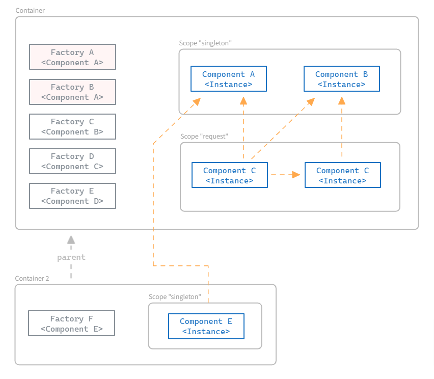

# General Concepts



## Component

Any object (simple or complex) that the developer wishes to register in the container to be used by other (injected) components. During dependency injection, the injected constructor does not know how the requested component will be created. The container resolves the dependency, simplifying the development of complex systems.

## Factory

It informs how an instance of a component can be created. The developer registers a component constructor or even an instance in the container, and the container performs the necessary processing to generate the factory for that component and resolve its dependencies when the constructor is invoked. It is possible to have more than one factory for the same type of component. The container ensures that the correct instance is obtained according to the rules described later in this document.

## Scope

It manages the lifecycle of an instance. The developer specifies the scope of the component during registration. When the component is requested, the container asks the defined scope for the instance. The scope can return an existing instance or create a new one. This allows for the instantiation of components with various lifecycles; for example, instances that will be discarded at the end of a web request and other singleton instances that will remain alive until the entire application is terminated.

## Container

[`di.Container`](https://github.com/go-path/di/blob/main/container.go#L17) is owr IoC Container. Allows the developer to register and obtain their components.

If necessary, you can instantiate new containers using the method `New(parent Container) Container`. We've already registered a [global](https://github.com/go-path/di/blob/main/global.go) container and exposed all methods to simplify the library's usage.

Usually, you only need to interact with the method `di.Register(ctor any, opts ...FactoryConfig)` for component registration and finally the method `di.Initialize(contexts ...context.Context) error` for the container to initialize the components configured as 'Startup'.

When conducting unit tests in your project, take a look at method `Mock(mock any) (cleanup func())`.

If you're building a more complex architecture in your organization or a library with DI support, you'll likely use the methods below and others documented in the API to have full control over the components.

```go
type Container interface {
    RegisterScope(name string, scope ScopeI) error

    Get(key reflect.Type, ctx ...context.Context) (any, error)
    Filter(options ...FactoryConfig) *FilteredFactories

    Contains(key reflect.Type) bool

    GetObjectFactory(factory *Factory, managed bool, ctx ...context.Context) CreateObjectFunc
    GetObjectFactoryFor(key reflect.Type, managed bool, ctx ...context.Context) CreateObjectFunc
    ResolveArgs(factory *Factory, ctx ...context.Context) ([]reflect.Value, error)
    Destroy() error

    DestroyObject(key reflect.Type, object any) error
    DestroySingletons() error
}
```
